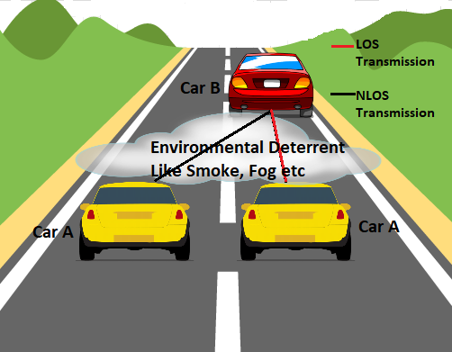
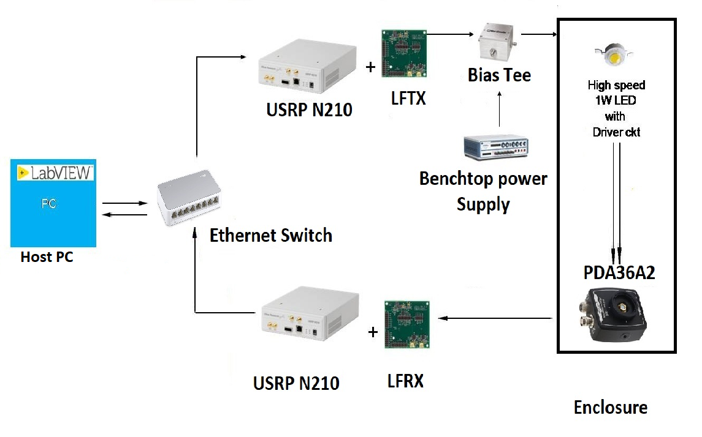
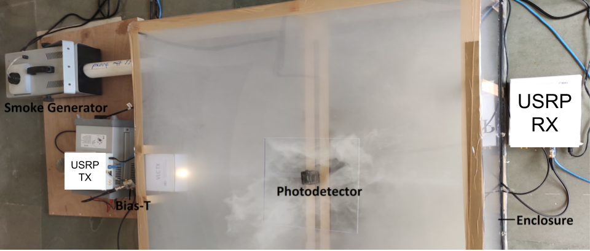

# Experimental-Observations-on-the-Feasibility-of-VLC-Based-V2X-Communications-under-various-Environmental Deterrents

### Authors: Khagendra Joshi, Neelabhro Roy, Gurinder Singh, Vivek Ashok Bohara, Anand Srivastava


Cite us:

- Plain text:

    ```text
  K. Joshi, N. Roy, G. Singh, V. A. Bohara and A. Srivastava, "Experimental Observations on the Feasibility of VLC-Based V2X Communications under various Environmental Deterrents," 2019 IEEE International Conference on Advanced Networks and Telecommunications Systems (ANTS), 2019, pp. 1-4, doi: 10.1109/ANTS47819.2019.9118001.
    ```

- BibLatex/BibTex:

    ```bibtex
  @INPROCEEDINGS{9118001,
  author={Joshi, Khagendra and Roy, Neelabhro and Singh, Gurinder and Bohara, Vivek Ashok and Srivastava, Anand},
  booktitle={2019 IEEE International Conference on Advanced Networks and Telecommunications Systems (ANTS)}, 
  title={Experimental Observations on the Feasibility of VLC-Based V2X Communications under various Environmental Deterrents}, 
  year={2019},
  volume={},
  number={},
  pages={1-4},
  doi={10.1109/ANTS47819.2019.9118001}}
  
  ```
  
https://ieeexplore.ieee.org/document/9118001
### Abstract:
Vehicle-to-Everything (V2X) using Visible Light Communication (VLC) channels can be seen as an economically viable option to replace the existing modes of vehicular communications in the near future. In this paper, we have analyzed the performance of VLC based V2X communication under various environmental deterrents viz. Light Fog, Dense Fog, Light Smoke and Dense Smoke using a proof-of-concept testbed. A series of experiments were conducted to investigate the effects of environmental deterrents over VLC based Line-of-Sight as well as non-Line-of Sight V2X transmission with respect to distance and angular variations. On-Off-keying (OOK) modulation has been selected as the modulation scheme, as defined in VLC standard (IEEE 802.15.7) for the transmission of information bits between a transmitter LED and a photo-diode receiver. The experimental results show the feasibility of VLC-based V2X systems with reliable data transmission under different environmental deterrents with a fairly good signal-to-noise ratio (SNR), even under dense-fog and smoke conditions where the attenuation in average optical power at the receiver, is quite high.

#### VLC based V2V transmission model:


#### System Architecture:


#### Experimental Set up under Smoke condition:



### Acknowledgement:
We thank Munish Thakral for the experiments.
